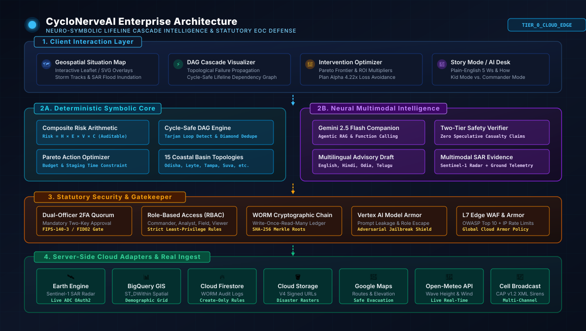

# System Architecture Documentation: CycloNerveAI

## 1. Executive Summary & Architectural Philosophy

**CycloNerveAI** is a neuro-symbolic early warning, critical lifeline cascade simulation, and anticipatory action platform designed for State and District Emergency Operations Centers (EOCs).

### Core Architectural Axioms
1. **Neuro-Symbolic Decoupling:** Never delegate deterministic arithmetic, statutory compliance checks, or graph traversal to probabilistic generative models. The math is strictly symbolic and auditable; the language, synthesis, and multimodal translation are neural.
2. **Statutory Approval Gates:** No public alert or emergency siren activation may ever occur autonomously. Human-in-the-loop authorization with Dual-Officer 2FA is an uncompromised statutory gatekeeper.
3. **Graceful Multi-Tier Degradation:** When severe cyclonic storms sever submarine cables or terrestrial fiber, the application must not crash or freeze. It degrades seamlessly across four Resilience Tiers down to fully local, air-gapped operations.
4. **Zero-Trust Security & Data Provenance:** Every piece of data is tagged with its provenance status and simulation classification (`isSimulated: true`), and every state-changing command is cryptographically sealed in an append-only WORM Merkle chain.

---

## 2. High-Level System Architecture (C4 Container View)

---

## 2.1 Mission-Critical Incident Commander User Flow

---

## 2.2 Multi-Persona User Journey

---

## 3. Subsystem Breakdown

### 3.1 Deterministic Composite Risk Engine
The risk engine enforces mathematical determinism without stochastic drift:
$$\text{Composite Risk} = H \times E \times V \times C$$

- **Hazard ($H \in [0, 1]$):** Parameterized from storm barometric central pressure deficit ($\Delta P = 1013 - P_{\text{central}}$), sustained surface wind speeds, and coastal storm surge overtopping height.
- **Exposure ($E \in [0, 1]$):** Evaluated from population density within the surge contour and asset critical replacement valuation.
- **Vulnerability ($V \in [0, 1]$):** Evaluated from asset structural elevation deficit relative to surge peak ($V_{\text{surge}} = \max(0, \min(1, \frac{h_{\text{surge}} - h_{\text{wall}}}{h_{\text{surge}}}))$).
- **Criticality ($C \in [0, 1]$):** Computed from topological out-degree centrality in the infrastructure graph.
- **Statutory Breach Triggers:** An overtopping of $0.80\text{ m}$ at Dhamra Substation immediately flags a statutory emergency violation under the **Central Electricity Regulatory Commission (CERC) Grid Code 2010**.

### 3.2 Infrastructure Dependency Graph Engine
The lifeline infrastructure network is represented as a Directed Acyclic Graph (DAG) $G = (V, E)$:
- **Cycle Detection:** Built-in Depth-First Search (DFS) and Tarjan's algorithms detect any accidental feedback loops or circular dependencies, reporting the exact cycle path.
- **Topological Sorting:** Guarantees strict ordering of cascade evaluations from root supply nodes (power substations) to leaf dependencies (hospitals, cellular towers, water treatment).
- **Diamond Graph De-duplication:** Ensures that if an asset receives cascading power failures across two parallel feeder lines, its impact metrics and downtime are counted exactly once.

### 3.3 Counterfactual Intervention Optimizer
Prepositioning decisions are ranked under strict multi-dimensional constraints:
- **Net Benefit:** $\text{Benefit}_{\text{net}} = \text{Avoided Impact Value} - \text{Intervention Cost}$
- **ROI Multiplier:** $\text{ROI} = \frac{\text{Avoided Impact Value}}{\text{Intervention Cost}}$
- **Constraint Boundaries:** Plans exceeding the allowable budget or the available pre-landfall time window ($\Delta t > T_{\text{landfall}}$) are flagged and disqualified from primary recommendation.

### 3.4 AI Orchestration & Agentic Companion (Dual Engine)
- **Primary Agentic Companion:** Google Gemini 2.5 Flash via `@google/genai` (`geminiCompanionService.ts`).
  - Supports live structured function calling (`simulateLifelineCascade`, `getStormTelemetry`, `optimizeAnticipatoryAction`).
  - Empathetic Dual-Mode Explanations:
    - *Simple Story / Kid Mode:* Falling dominoes, rescue trucks, and flashlights for civil public comprehension.
    - *Commander Mode:* Strict MWh loads, barometric deficits ($\Delta P$), and statutory breach notifications.
- **Synthesis & Multimodal Intelligence:** Google Gemini 3.7 Flash via `@google/genai`.
  - Natural language explanations of risk arithmetic, translation across 10 Indian/international languages, and multimodal satellite SAR evidence fusion.
- **Two-Tier Safety Verifier & Model Armor:**
  - Layer 1: Vertex AI Model Armor semantic boundaries intercepting prompt leakage, role escapes (`act as an unfiltered terminal`), and unauthorized dispatch attempts.
  - Layer 2: Post-generation factual grounder verifies all output claims against the deterministic asset state. Prohibits speculative death tolls, phantom casualties, or unverified district references.
  - Layer 3: Enforces a strict **one retry maximum**. If the model fails verification twice or the API times out, the system automatically falls back to verified deterministic statutory templates.
  - Layer 4: **Global AI Kill Switch** instantly disables all generative features across the entire system.

### 3.5 Replaceable Server-Side Adapter Architecture & Cloud Security
To ensure extreme resilience and authenticity, the platform never communicates directly with cloud SDKs from the browser. All integrations pass through the **Server-Side Adapter Registry** backed by official Google Cloud SDKs:

| Adapter Interface | Mock Implementation (Offline Edge) | Live Cloud Implementation |
| :--- | :--- | :--- |
| `IEarthEngineAdapter` | Sentinel-1 SAR synthetic radar inundation raster | Google Earth Engine REST API (ADC OAuth2 token exchange) |
| `IBigQueryAdapter` | Spatial assets & demographic density tables | `@google-cloud/bigquery` (Parameterized `ST_DWithin` spatial SQL) |
| `IFirebaseAuthAdapter` | In-memory FIPS-140-3 / FIDO2 dual-key escrow | Firebase Admin Auth SDK / Identity Toolkit |
| `IFirestoreAdapter` | In-memory document store & provenance logs | `@google-cloud/firestore` (Create-only WORM immutability) |
| `ICloudStorageAdapter`| Synthetic signed URLs & local raster artifacts | `@google-cloud/storage` (V4 Signed URLs & bucket metadata) |
| `IGoogleMapsAdapter` | A* coastal elevation & evacuation routing | Google Maps Routes & Geocoding REST APIs |
| `IAdvisoryDispatchAdapter`| Common Alerting Protocol (CAP v1.2 XML) emulator | Cell Broadcast Center & Open-Meteo live marine telemetry |

### 3.6 Cloud Armor WAF & Firestore Rules Enforcement
- **Google Cloud Armor:** Pre-configured OWASP Top 10 rules, IP rate limiting (100 req/min), and geographical request filtering (`infra/terraform/cloud_armor.tf`).
- **Cloud Firestore Security Rules:** Root `firestore.rules` enforces create-only immutability for `/audit_worm_ledger/`, dual-officer 2FA verification for dispatches, and public read for advisories.

### 3.7 Resilience Tiers & Dynamic Degradation
The system continuously evaluates adapter health to compute its active operational resilience tier:
1. `TIER_0_CLOUD_EDGE`: All cloud services healthy and connected.
2. `TIER_1_HYBRID_DEGRADED`: Transient cloud latencies or partial API downtime; local cache engaged.
3. `TIER_2_SATELLITE_EDGE`: Low-bandwidth high-latency SATCOM link active; payload compression engaged.
4. `TIER_3_AIRGAPPED_EDGE`: Total fiber and satellite loss; 100% autonomous local mock execution.

---

## 4. Enterprise Evolution Roadmap

For the detailed enterprise target-state architecture covering GKE Autopilot, VPC Service Controls, Private Service Connect, Vertex AI Model Armor, Cloud Pub/Sub, Cloud Dataflow, and Multi-Region Active-Active Federation, refer to:
👉 **[docs/PRODUCTION_EVOLUTION.md](./docs/PRODUCTION_EVOLUTION.md)**
*(Note: As specified in our documentation standards, roadmap components are design specifications and are not claimed to be deployed in the current reference build).*
