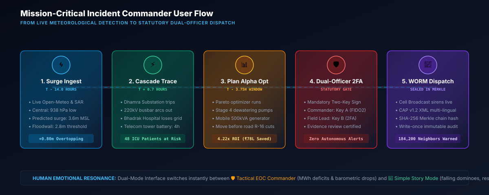
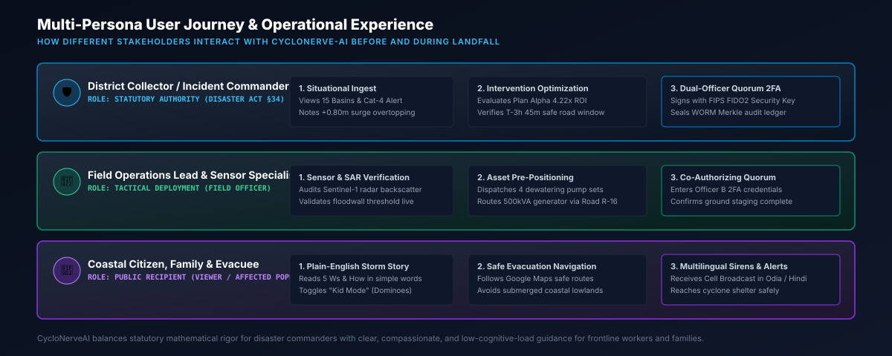

# Demonstration Scenario Guide: Cyclone Samudra - Odisha Coast

## Scenario Profile

- **Scenario Identifier:** `SCENARIO-ODISHA-SAMUDRA-01`
- **Classification:** `simulated` / `derived` (`isSimulated: true`)
- **Hazard Type:** Very Severe Cyclonic Storm (Category 4 Equivalent)
- **Geographic Theater:** Bhadrak & Kendrapara Coastal Districts, Odisha, India
- **Landfall Target:** Dhamra Port / Chandbali Coastal Sector
- **Operational Timeline:** $T - 14.0\text{ hours}$ to Landfall

```
========================================================================================
METEOROLOGICAL TELEMETRY: CYCLONE SAMUDRA
========================================================================================
Storm Eye Coordinates:       20.805 N, 86.953 E
Central Barometric Pressure: 938 hPa (Deficit: 75 hPa)
Max Sustained Surface Winds: 195 km/h (Gusts: 225 km/h)
Forward Translation Speed:   16 km/h (Bearing: 325 deg NW)
Predicted Peak Storm Surge:  3.6 meters MSL (Astronomical Spring Tide Phase)
========================================================================================
```

---

## Operational Workflow & User Journey





---

## Critical Lifeline Infrastructure Under Threat

### 1. Dhamra 220/132kV Primary Substation (`ASSET-SUB-DHAMRA-01`)
- **Function:** Root grid power feed for 42 coastal villages, port terminals, and regional hospitals.
- **Physical Elevation:** 2.2 meters MSL.
- **Perimeter Floodwall:** 2.8 meters MSL.
- **Surge Breach Calculation:** Predicted surge ($3.6\text{ m}$) exceeds floodwall ($2.8\text{ m}$) by **0.80 meters**.
- **Statutory Breach:** Triggers mandatory shutdown under Central Electricity Regulatory Commission (CERC) Grid Code 2010 regulations.

### 2. Bhadrak District General Hospital (`ASSET-HOSP-BHADRAK-01`)
- **Function:** 350-bed referral hospital, 24 ICU beds, neonatology ventilators, central liquid oxygen plant.
- **Grid Dependency:** Direct feeder from Dhamra Substation.
- **Vulnerability:** On-site diesel generator fuel storage limited to 6 hours under full load.

### 3. Coastal Telecom Microwave Backhaul Towers (`ASSET-TEL-DHAMRA-01`)
- **Function:** Cellular broadcast, emergency sirens, and satellite telemetry backhaul.
- **Grid Dependency:** Dhamra Substation. Battery buffer reserve limited to 4 hours post-blackout.

### 4. Dhamra Port Industrial & LNG Terminal (`ASSET-PORT-DHAMRA-01`)
- **Function:** Cryogenic liquid storage and commercial bulk berthing.
- **Hazard:** Surge overtopping causes sea water contamination of ballast manifolds and electrical switchgear.

---

## Step-by-Step Scenario Execution Walkthrough

### Step 1: Explore the Unified Situation Room
1. Launch the platform at `http://localhost:3000`.
2. Observe the **Global Situation Header** displaying:
   - Storm Category: `Cat 4 VSCS (195 km/h)`
   - Central Pressure: `938 hPa`
   - Active Resilience Tier: `TIER_0_CLOUD_EDGE` (with all 7 adapters operational).
3. The interactive map highlights the storm track, 195 km/h wind radius, and Sentinel-1 SAR inundation mosaic along the Dhamra estuary.

### Step 2: Trace the Lifeline Cascade Graph
1. Navigate to the **Cascade Graph** tab.
2. Observe the Directed Acyclic Graph (DAG) visualizing how failure at `Dhamra Substation` cascades down to `Bhadrak Hospital ICU`, `Telecom Towers`, and `Port Operations`.
3. Click on the `Dhamra Substation` node to examine the **Factor-Level Risk Breakdown**:
   - $H = 0.88$ (Wind 195 km/h + Surge 3.6m)
   - $E = 0.75$ (Regional population and critical lifelines)
   - $V = 0.92$ (0.8m overtopping above perimeter floodwall)
   - $C = 0.95$ (High topological degree centrality)
   - **Composite Risk Score:** $0.88 \times 0.75 \times 0.92 \times 0.95 = 0.576$ (Critical High Risk).

### Step 3: Run Counterfactual Intervention Analysis
1. Navigate to the **Interventions** tab.
2. Review the three competing pre-landfall intervention plans:
   - **Plan Alpha (Aggressive Lifeline Hardening):** Staging 4 high-capacity mobile dewatering pumps, 1.2m inflatable sandbag berms around transformer bays, and prepositioning a 500kVA mobile diesel genset at Bhadrak Hospital.
     - *Cost:* ₹18.5 Lakhs | *Avoided Damage:* ₹78.0 Lakhs | *ROI Multiplier:* **4.22x**
   - **Plan Beta (Hospital-Only Isolation):** Prioritizes generator fuel supply and emergency patient evacuation without protecting the substation.
     - *Cost:* ₹9.2 Lakhs | *Avoided Damage:* ₹24.5 Lakhs | *ROI Multiplier:* **2.66x**
   - **Plan Gamma (Minimal Sandbagging):**
     - *Cost:* ₹3.0 Lakhs | *Breaches Time Window constraint* ($\Delta t > 14\text{ hours}$).
3. Select **Plan Alpha** to simulate the counterfactual benefit: composite risk drops from **0.576** to **0.142**, and cascade propagation is arrested at Step 1.

### Step 4: Multilingual Advisory Drafting & Safety Verification
1. Navigate to the **Advisories & Approval** tab.
2. Select draft advisory `ADV-2025-089-REV2` ("Urgent Coastal Evacuation & Hospital Islanding Order").
3. Inspect the draft across all 4 statutory languages:
   - **English:** Authoritative disaster management directives.
   - **Hindi:** Clear evacuation shelter route guidance.
   - **Odia:** Vernacular coastal language for local panchyat alerts.
   - **Telugu:** For fishing communities and coastal vessel operators.
4. Verify the **Safety Verifier Badge**: confirms zero speculative casualty claims, 100% boundary check against Bhadrak district, and prompt-injection resistance.

### Step 5: Dual-Officer FIDO2 Approval & Broadcast Dispatch
1. Notice that the **Dispatch Advisory** button is disabled until statutory approval is executed.
2. Review the **Multimodal Evidence Summary** (Sentinel-1 SAR flood mosaic and ground photo telemetry).
3. Check the **Certified Evidence Review** checkbox.
4. Click **Certify & Approve Advisory** as Incident Commander (`Dr. Arvind Rao, IAS`).
5. Open the **Dual-Officer 2FA Modal**:
   - Primary Officer: `Dr. Arvind Rao, IAS (Incident Commander)`
   - Secondary Officer: `Shri Manoj Das, IPS (Additional District Magistrate)`
6. Click **Authorize & Broadcast Dispatch**:
   - Dispatches simultaneously across: Common Alerting Protocol (CAP v1.2 XML), Cell Broadcast Center, Emergency SMS Gateway, and Municipal Coastal Sirens.
   - Seals the action in the cryptographic WORM audit trail with a SHA-256 Merkle leaf hash.
